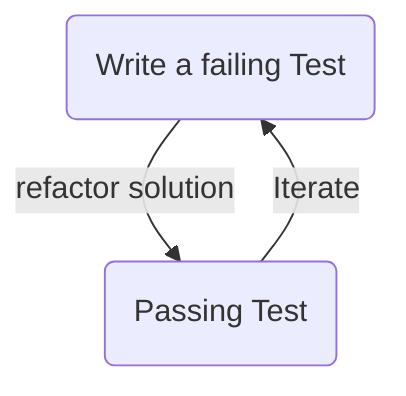

# Welcome to your interview with Nimbuspay Technologies.

Your interview will comprise a short conversation about your experience followed by a live pair programming exercise 
with two of our senior engineers. One of whom will be your Pair to complete a simple code kata; whilst the 
other observes and asks questions.

The exercise chosen will be designed to be simple and straight forward, it is **not** expected that you will fully 
complete the chosen task in the time available.  It is how you devlop the tests and solution for the exercise that we
want to see.

** Have this repository checked out, built and available in your chosen IDE before the interview begins.**

### You will need the following before joining the call

* A computer capable of running your chosen java IDE alongside teams desktop sharing
* A quiet working environment;  as the live pairing demands clear two-way audio and video communication.
* A modern version of Java installed (at least java 17)
* The ability to share your complete desktop during the call for the exercise
* A working git command
* This repository checked out, built (./gradlew clean build) and ready to use during your interview
* A good, reliable internet connection

### Exercise 
The task you will be asked to complete in a pair will be one of the code kata found on https://codingdojo.org/kata/
and as with all code katas, it will be completed using a TDD approach.

